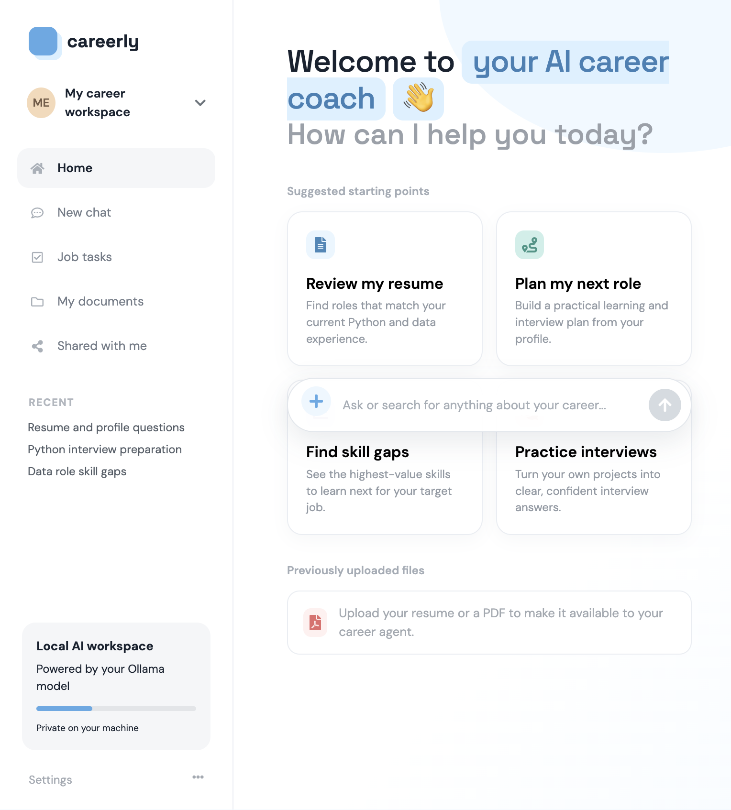
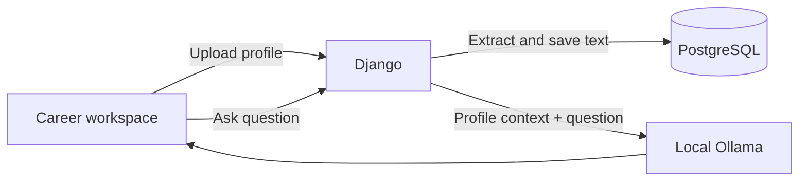

# Personal AI Career Agent

A Django chatbot that turns your resume into a private career coach for Python, data, software, and IT roles. Upload a PDF, DOCX, Markdown, or text file, then ask questions about your experience, skill gaps, interviews, and next career steps.



## Features

- Local Ollama chat generation
- Resume/profile upload with PDF, DOCX, Markdown, and text extraction
- Career profile persistence in PostgreSQL
- Follow-up conversation memory
- Three-dot typing animation while the model responds
- Responsive career workspace UI
- Optional LlamaIndex and pgvector RAG support

## Quick start

### Requirements

- Docker Desktop with Compose
- Ollama installed and running on the host
- An Ollama model, such as `llama3.2:latest`

### Setup

```bash
git clone <your-repository-url>
cd llm-article-analyzer
cp .env.example .env
ollama pull llama3.2:latest
docker compose up -d --build
```

Open the app at [http://localhost:8000/](http://localhost:8000/).

If migrations are disabled in your local `.env`, run them once:

```bash
docker compose run --rm app python manage.py migrate
```

Create an admin user when needed:

```bash
docker compose run --rm app python manage.py createsuperuser
```

Admin: [http://localhost:8000/admin/](http://localhost:8000/admin/)

## Using the agent

1. Click the **+** button in the chat composer.
2. Upload your resume or profile file.
3. Wait for the extraction confirmation.
4. Ask questions such as:

```text
Which Python or data roles fit my experience?
What skills should I learn next for data engineering?
Create interview questions based on my projects.
Rewrite my strongest project for a data analyst resume.
```

The default `.env.example` uses:

```dotenv
LLM_BACKEND=OLLAMA
OLLAMA_HOST=http://host.docker.internal:11434
OLLAMA_MODEL=llama3.2:latest
OPENAI_API_KEY=
RAG_ENABLED=0
```

`RAG_ENABLED=0` is intentional for chat-only Ollama installations that do not provide embeddings. The uploaded profile is still included directly in the model context.

## Architecture



- `app/chatbot/views.py`: upload extraction and agent orchestration
- `app/chatbot/models.py`: saved `CareerProfile` model
- `app/chatbot/ollama.py`: LangChain-compatible Ollama wrapper
- `templates/chatbot.html`: career workspace UI
- `docker-compose.yml`: Django and PostgreSQL services

## Development

Run tests:

```bash
docker compose run --rm app python manage.py test app.chatbot.tests
```

Run Django checks:

```bash
docker compose run --rm app python manage.py check
```

View logs:

```bash
docker compose logs -f app
docker compose logs -f db
```

Stop the stack:

```bash
docker compose down
```

## Troubleshooting

Check Ollama on the host:

```bash
curl http://localhost:11434/api/tags
```

If the model is missing:

```bash
ollama list
ollama pull llama3.2:latest
```

If a PDF returns no text, it may be scanned or image-only. The current extractor reads embedded text but does not perform OCR.

For local development, keep Ollama at `http://localhost:11434` on the host. Docker reaches it through `host.docker.internal`.

## Privacy

With the default Ollama configuration, resume text and model prompts stay on your machine. Do not commit `.env`, API keys, or production database passwords.

## License

No license has been declared yet.
