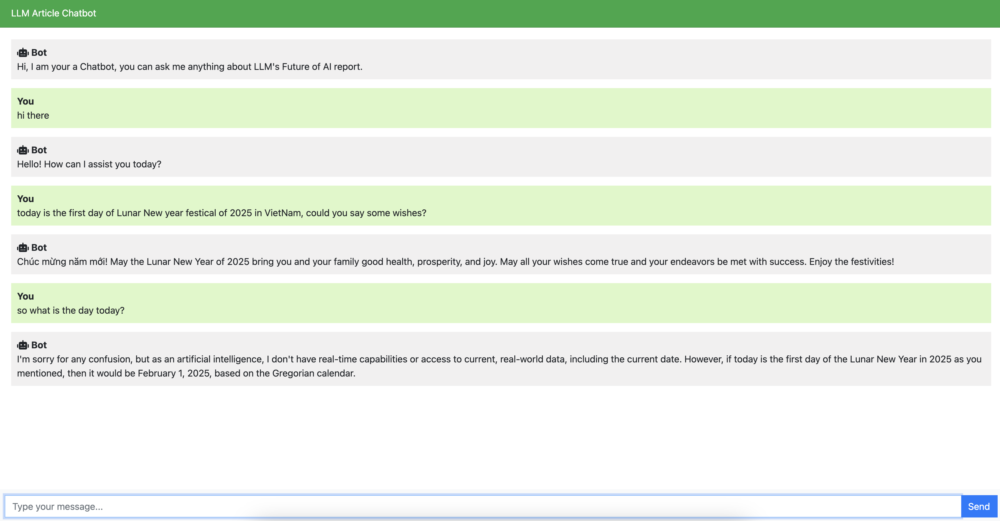
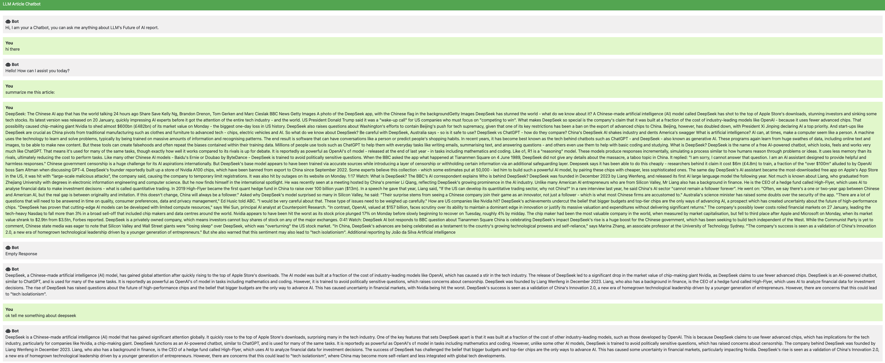

# RAG-chatbot

## Proof of Concept for a knowledge chatbot using Retrieval Augmented Generation (RAG) techniques.
This is a proof of concept of using RAG techniques to add 3rd party information to an LLM. It is agentic, has memory, and a number of advanced & emerging RAG techniques were experimented on. A simple chat UI was built to facilitate the question and answering.



### Architecture
**It is built using the following architecture**
- The RAG system built on Langchain for orchestrating agents, LlamaIndex for retrieval, pgvector for vectorstore, OpenAI for embeddings & llm.
- Django backend.
- Simple chat frontend using basic html, bootstrap css, and javascript.

### Features
The agentic behavior of the RAG system **autonomously decides whether or not the 'LLM Future of AI Report' tool needs to be used** to answer the user's query. Here in the console log, you can see the LLM first considering whether or not it is appropriate to search the report to answer the user's query.

It also **holds memory of the previous conversation** so that it can keep track of conversation context. Here you can see that it remembers a user prompt from the previous conversation. It is currently given a rolling six messages (k=6) of additional memory context.



### HOW TO RUN

- Start the application:
    ```
    docker-compose up -d db
    docker-compose up --build app
    ```
